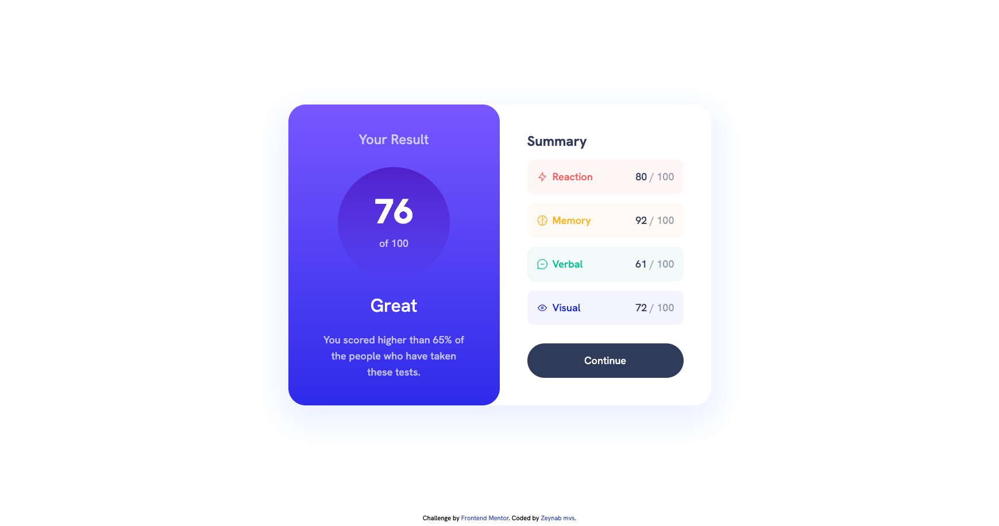

# Frontend Mentor - Results summary component solution

This is a solution to the [Results summary component challenge on Frontend Mentor](https://www.frontendmentor.io/challenges/results-summary-component-CE_K6s0maV). Frontend Mentor challenges help you improve your coding skills by building realistic projects. 

## Table of contents

- [Overview](#overview)
  - [The challenge](#the-challenge)
  - [Screenshot](#screenshot)
  - [Links](#links)
- [My process](#my-process)
  - [Built with](#built-with)
  - [What I learned](#what-i-learned)
  - [Continued development](#continued-development)
  - [Useful resources](#useful-resources)
- [Author](#author)
- [Acknowledgments](#acknowledgments)


## Overview

### The challenge

Users should be able to:

- View the optimal layout for the interface depending on their device's screen size
- See hover and focus states for all interactive elements on the page
- **Bonus**: Use the local JSON data to dynamically populate the content

### Screenshot



### Links

- [Github repository](https://github.com/zeynabmvs/fem-result-summary-component)
- [Live Site URL ](https://fem-result-summary-component-three.vercel.app/)

## My process

### Built with

- Typescript
- Vercel
- Vite
- [React 18](https://react.dev/) - JS library
- Tailwindcss

### What I learned

This was my first project using TypeScript. I read the documentation and implemented TypeScript into the project. I tried to style the summary item box using dynamic Tailwind CSS classes (like so: bg-primary-${variant}), which failed because of how Tailwind generates styles. Then, I found a solution using the safelist in Tailwind's configuration:

```js
  safelist: [
    'text-primary-red',
    'text-primary-yellow',
    'text-primary-green',
    'text-primary-blue',
    'bg-primary-red',
    'bg-primary-yellow',
    'bg-primary-green',
    'bg-primary-blue',
  ]
```
by adding this to tailwind config I was able to create styles based on data on the fly

### Continued development

- I want to continue my learning of typescript

### Useful resources

- [Using typescript with React ](https://react.dev/learn/typescript)

## Author

- Frontend Mentor - [@zeynabmvs](https://www.frontendmentor.io/profile/zeynabmvs)

## Acknowledgments

I used ChatGPT as a coding buddy and mentor. I had some problems setting up TypeScript and absolute paths, but with ChatGPT, the process became smooth, and it directed me to write better code.

